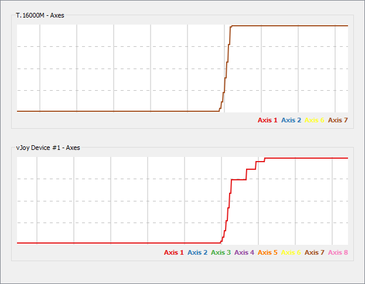

# Average Filter

## Description

Implements a temporal moving average filter which computes the mean over the last N samples with a fixed time interval between samples to provide a stable behaviour. This can be used to smooth out axis with jitter from bad sensors at the cost of input delay.

## Variables

| Variable            | Function                                          |
| ------------------- | ------------------------------------------------- |
| Mode                | The mode in which the plugin is active            |
| Virtual output axis | The vJoy axis to feed the filtered value into     |
| Physical input axis | The axis whose input is to be filtered            |
| Number of samples   | The amount of samples to compute the average over |
| Update rate (ms)    | Time to wait before accepting new samples         |

## Example

The image below shows the time delay incurred by running the average filter with default settings.

