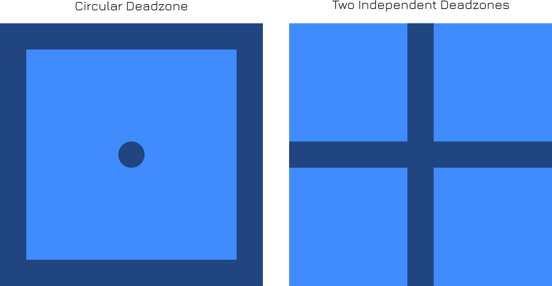

# Circular Deadzone

## Description

This plugin implements a two axis deadzone, allowing for a circular deadzone around the neutral point of the two axes and a square deadzone around the maximum deflection of both axes.

## Variables

| Variable        | Function                                                     |
| --------------- | ------------------------------------------------------------ |
| Mode            | The mode in which the plugin is active                       |
| Physical X axis | Physical axis corresponding to the X direction               |
| Physical Y axis | Physical axis corresponding to the Y direction               |
| vJoy X axis     | vJoy axis onto which the physical X axis is mapped           |
| vJoy Y axis     | vJoy axis onto which the physical Y axis is mapped           |
| Inner deadzone  | Amount of deadzone (circular) around the center of both axes |
| Outder deadzone | Amount of deadzone (square) around the edge of the maximum deflection of both axes |

## Example

The image below shows the difference in deadzone behaviour of the plugin (left) and using the standard deadzone option in the response curve action (right). The dark blue areas indicate deadzones while the light blue are non-deadzone areas.

